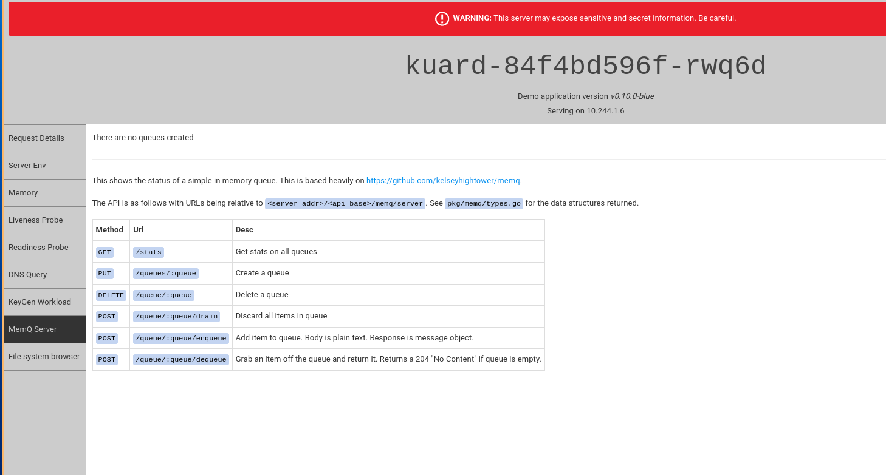
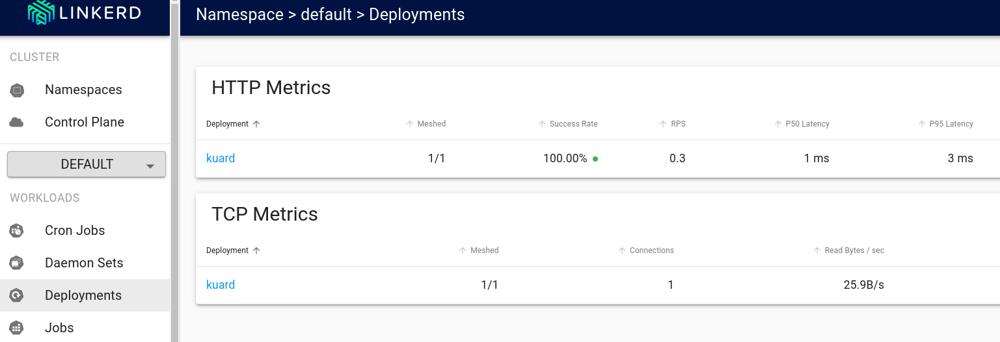
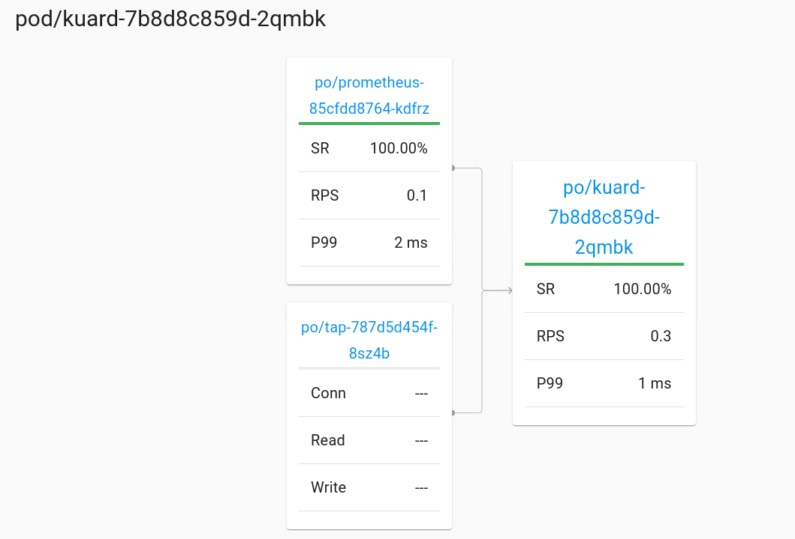

# Mutual TLS with Linkerd

Developing with Kubernetes in mind means developing Cloud Native applications[.
CNCF](https://www.cncf.io/) defines cloud-native as:

Cloud-native technologies empower organizations to build and run scalable applications in modern, dynamic environments such as public, private, and hybrid clouds. Containers, **service meshes**, microservices, immutable infrastructure, and declarative APIs exemplify this approach.

These techniques enable **loosely coupled** systems that are **resilient**, manageable, and observable. Combined with robust automation, they allow engineers to make high-impact changes frequently and predictably with minimal toil.
<p style="text-align: center;"><small>Source: https://github.com/cncf/foundation/blob/master/charter.md</small></p>

Cloud-native applications require a different architectural approach. Service mesh helps achieve the cloud-native architectural goals by **moving complexity from the application to the underlying infrastructure**

> Visit Linkerd documentation if you need a refresher about [service mesh](https://linkerd.io/what-is-a-service-mesh/)

## What problems do service meshes solve?

Service meshes add observability, security, and reliability features to “cloud native” applications by transparently inserting this functionality at the platform layer rather than the application layer.

- Platform Level Metrics: without changing configuration or source code, track low level metrics
- **Mutual TLS - mLTS**: add encryption and certificates based identity to cluster workloads
- Improved Resiliency: latency aware load balancing, retires, timeouts and advanced deployment patterns
- Authorization Policy: enforce traffic rules on services level

Service meshes are advanced and complex topic, so instead of focusing on all functionalities at once we will tackle one at a time. We will explore how service mesh can help with securing inter-cluster communication.

## Authenticate and encrypt infernal traffic

The premise of service mesh is to move accidental architectural complexity such as logging, monitoring or encryption and authentication to the underlying platform rather than require individual applications to implement similar logic on a framework or programming level.

There are 2 popular service meshes, [Istio](https://istio.io/) and [Linkerd](https://linkerd.io/). We are going to use Linkerd to see how to encrypt and authenticate traffic, but the same would work with Istio.

> In 2021 Linkerd [moved to _graduated_ status](https://www.cncf.io/announcements/2021/07/28/cloud-native-computing-foundation-announces-linkerd-graduation/) of CNCF projects, joining projects like _Kubernetes_, _etcd_, _rook_ or _helm_

Once installed on the cluster, linkerd control plane will inject sidecars to Kubernetes system pods. From there we can inject sidecars to the pods and create a service mesh.


## Demo example

If you would like to try out how Linkerd secures and authenticates traffic in a Kubernetes cluster, head over to Katacoda and follow this self-paced lab.

[Katacoda Lab](https://www.katacoda.com/decoder/courses/k8s-networking/k8s-networking-linkerd)

The lab scenario:

➡ install linkerd CLI 

`linkerd version`

➡ check if the cluster is ready for the control plane installation

`linkerd check --pre`

➡ install linkerd control plane

```bash
linkerd install | kubectl apply -f -
```

➡ check linkerd installation

`linkerd check`

> be patient, this can take a while ⌛

➡ create sample deployment

`kubectl create deployment --image=gcr.io/kuar-demo/kuard-amd64:blue kuard`

➡ wait for the pod to come up

`kubectl wait deployment kuard --for=condition=Available --timeout=1m`

➡ forward traffic to the pod

`kubectl port-forward deploy/kuard 8080:8080 --address 0.0.0.0 &`


💉 inject linkerd sidecar

> Before injecting the linkerd sidecar, let's see how many containers run inside kuard pod. There should be only kuard container running.

`kubectl get pods -l app=kuard -o jsonpath='{.items[*].spec.containers[*].name}{"\n"}'`

➡ inject linkerd sidecar into kuard pod

```bash
kubectl get deploy kuard -o yaml \
  | linkerd inject - \
  | kubectl apply -f -
```

➡ make sure linkerd sidecar applied correctly

`linkerd -n default check --proxy`

➡ we should see the linkerd sidecar running in the pod

`kubectl get pods -l app=kuard -o jsonpath='{.items[*].spec.containers[*].name}{"\n"}'`

➡ install observability extension

`helm repo add linkerd https://helm.linkerd.io/stable`

```bash
helm install linkerd-viz \
  --set dashboard.enforcedHostRegexp=.* \
  linkerd/linkerd-viz
```

➡ make sure the installation succeeded

`linkerd check`

➡ launch the dashboard in background

```bash
linkerd viz dashboard --address 0.0.0.0 &
```

➡ check if mTLS works between system pods and kuard pod



👮 Mutual TLS

> All pods with the injected linkerd sidecar communicate by default with encrypted and authenticated traffic

➡ restart pod to enable tap configuration

```bash
kubectl rollout restart deployment kuard
```
➡ explore dashboard to see connectivity details



## Conclusion

Before you jump on and install Linkerd or Istio on your cluster, make sure that you understand operational and cognitive complexity that the service mesh brings on board.
For majority of the workloads, you don't need a service mesh. There are often alternatives that fulfill only the requirement you need without adding complexity with features you don't need.
